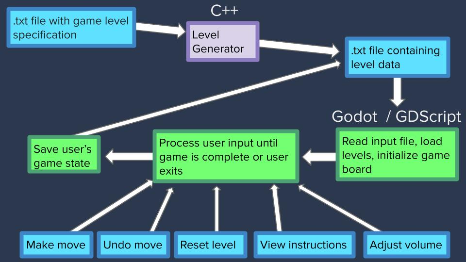

# Color Sort!
University of Tennessee, Knoxville
COSC 340: Software Engineering
Spring 2024
## Members:
* Shanna Wallace (netid: swalla16 | GitHub: shannaw04) 
* Coleman Oates (netid: coates4 | GitHub: coates4)
* Landon Boone (netid: tww489 | GitHub: landon-boone2001)
* Logan Lett (netid: llett3 | GitHub: 10-Squares)

## Project Description:
### What is Color Sort?
Color Sort is a puzzle game that starts with blocks of various colors shuffled up in bottles. You are given 1 empty bottle if there are 2 or 3 colors to be sorted and 2 empty bottles if there are 4+ colors. 

### Game Objective
The goal of the game is to sort all of the colors so that all blocks of the same color are in the same bottle.

### Gameplay Rules
You can move blocks of color from one bottle to another if:
* The source bottle is not empty
* The destination bottle is empty
* The destination bottle is not empty, but it has room available and its top color matches the source bottle's top color

You may only move as many blocks of color as will fit in the empty bottle

## Project Motivation
Our motivation for undertaking this project was to gain experience with mobile app development. We decided that a color sorting game would be an ideal beginner project for us to undertake, since it is simple enough for implementation to be achievable within two to three months, while also being complex enough to allow us to gain valuable experience with a variety of app development tasks. 

## Customer Value
Our goals for customer value remained unchanged throughout the project.  
We aimed to create fully functional Color Sort mobile game that is:
* Fun to play
* Easy to use
* Free of annoying and invasive ads
* Offers additional challenges and customization options

### Measuring Customer Satisfaction
Since we have not publicly released the app, we did not receive any measures of customer satisfaction. Were we to eventually release it, we would add an email for customers to contact. We would also consider reviews that customers leave on the app store. 
## Project Features
### Features Planned:
* Reset levels
* Undo moves
* Save game progress 
* Difficulty level customization
* Additional challenges:
    * Hide some colors from the user
    * Limit the number of moves that can made to complete the level
    * Give user limited amount of time to complete levels

### Features Actually Implemented:
&#9989; Reset levels  
&#9989; Undo moves  
&#10060; Save game progress  
&#9989; Difficulty level customization  
* Additional challenges:  
    &#9989; Hide some colors from the user  
    &#10060; Limit the number of moves that can made to complete the level  
    &#10060; Give user limited amount of time to complete levels  
    
### Description of Incomplete Features
Unfortunately, we were unable to fully implement the save game functionality before the due date. We are able to succesfully save and load the game state. However, loading a saved game causes probelms with the game control buttons, such as undo, reset, and start game. We were very close to completing this though, so we expect to be able to complete this feature soon.  
We did finish the game play timer, but since we do not have the save data functionality working yet, we are not able to save the user's best times. Once save is working, we will be able to add this feature in as well. We plan to add a rapid play game mode with the goal of surpassing your previous best time.  

To limit the number of moves a user can make, we would first need to find the minimum number of moves required to solve the level. We need not have time to add this data to our level information, so we were unable to add this feature.

## Technology Used and System Structure
We built our app on the Godot Game Engine V 4.2.
The game's code was written in Godot’s scripting language, GDScript
Levels were created by separate C++ level generation program.

 
### System Diagram

### System Description
* A C++ level generator program takes an input file specifying the number and types of levels required and outputs a .txt file with level data for a set of levels, one per line
* This level data text file is then input into the Godot program, were it is read, processed, stored, and used to load and initialize game levels
* The game program then accepts user input in the form of game moves, undoing moves, resetting levels, viewing instructions, or adjusting volume. The game will continue accepting input until the level is complete or the user exits the app
* When the user exits the game, their progress and game state will be saved to a .txt file, which will be loaded the next time the app is opened 

### Minimal Viable System
The requirments for our minimum viable system were: 
1. Load a level from a text file and display it on the screen
2. Accept and apply user input for game moves until the level is complete
3. Load the next level

We successfully acheived implementation of our minimal viable system. 

### Changes Made from Initial Plan:
We had some of the gameplay code working in C++ before beginning our work on the mobile app version. We originally considered using a C++ plug-in in Godot to use the existing C++ code. However, it ended up being easier to just rewrite the game in GDScript.

### Project Testing 
We predominantly tested the app manually, running it on desktop using Godot’s mobile app emulator. 
We also ran the game through Godot’s Android app to test sizing and usability of elements on a phone display. 
We tested incrementally, making that sure basic functionality worked before adding any additional features.
We had code review in our weekly meetings to plan and revise program structure and scripts.

## Team
### Project Manager
Shanna served as project manager, scheduling weekly meetings, planning project timeline, distributing tasks, and assigning issues on Github.

### Task Distribution
We aimed to give every member of the group some experience with each aspect of the development process, so our roles were dynamic. Tasks were divided on a weekly or bi-weekly basis. We did a lot of collaborative work in our weekly meetings. 

## Challenges 
### Learning Curve:
No one in the group had any prior experience with mobile app development, and only one member had any prior Godot experience. Much of our time on this project was spent learning how to use Godot and GDScript. 

### GDScript:
Though similar to Python, it was still a new language for everyone in the group. Additionally, it was the first time any of us had built a larger project with a scripting language. We had the gameplay algorithms worked out before beginning the project, but they were in C++, so we had to learn how to convert the existing C++ code to GDScript. 

### Code Organization and Program Structure:
We experienced difficulties figuring out the best way to structure and organize our program. Figuring out communication between different nodes, scenes, and scripts in the game was tough. We researched Godot best practices and tried to apply them to our project. 

### Version Control issues:
As we are all new to using Github for collaborative projects, we rean into some issues. For example, we had problems with one person's updates getting written over when another person merged their changes. Sometimes files that a user thought was in their directory when they merged did not get added to the project directory. Also, when merging tasks that were completed individually, sometimes one member’s updates would be incompatible with another’s.

### Level Solvability
Our level generator program occasionally creates levels that are not solvable. 
We planned to write a solver that would test levels for solvability, as well as count the minimum number of moves required to solve. We hoped to add a limited move challenge mode based on this, but ultimately did not have time to implement it. 

### Uploading Game to App Store:
We did not have enough time to fully prepare our app for an official public release. Until our save game function can be fully debugged, the app will start over at level 1 each time the user opens the app. There are also finishing details that need to be completed before a public release, such as a game icon, game logo, and licensing documentation.
Since no one in the group has any experience uploading a game to a real app store, this process would have taken us some time to research, which we did not have.
Also, the cost to upload to major app stores is cost prohibitive for us at this time:
* Apple Developer Program: $99
* Google Play Store: $25

## Achievements 
Despite the challenges we faced, we also made numerous acheivements with this project:
* Created a functional mobile game
* Aquired valuable exposure to mobile app and video game development 
* Gained experience working on a colloaborative software design project with others and using Github for version control
* Kept our project goals realistic for the time we had available, allowing us to acheieve our minimal viable system, as well as several additional features
* Have an impressive project to add to our resumes and GitHub portfolios
* Succeeded in our goal to create a mobile game that is fun to play, easy to use, and intuitive with a low barrier to entry  
